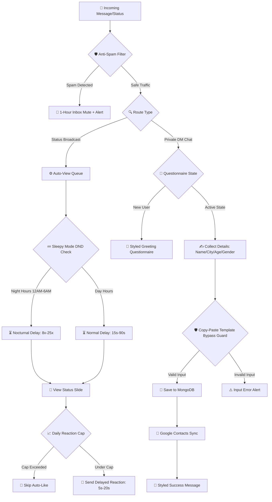

<div align="center">

# 🛡️ CHAMA-SHIELD MD

<p align="center">
  
  
  
  
</p>

<p align="center">
  
</p>

---

### ⚙️ CHAMA-SHIELD PIPELINE ARCHITECTURE



---

### 📊 WEB CONTROL DASHBOARD LAYOUT

```text
┌────────────────────────────────────────────────────────┐
│  🛡️ CHAMA-SHIELD CONTROL CENTER         [🟢 Online]   │
├────────────────────────────────────────────────────────┤
│  [21 Saved Contacts]   [0 Intercepts]   [5 Active Bots]│
├────────────────────────────────────────────────────────┤
│  ⚙️ Status Auto-View Delays: 15s - 90s                 │
│  ⚙️ Status Reaction Delays: 5s - 20s                    │
│  🛡️ Anti-Spam Inbox Mute: [Enabled]                    │
│  📈 Daily Auto-Like Reaction Cap: [250 Limit]          │
│  👤 Owner Profile: Chamindu (Galle, 18, Boy)           │
└────────────────────────────────────────────────────────┘
```

---

</div>

## 🚀 Key Features

* **🛡️ Advanced Anti-Ban Proxy Wrapper:** Dynamic browser user-agent spoofing (Chrome/Safari/Firefox), dynamic WhatsApp Web version checking, seen status duplicate filters, and human-like typing presence simulation.
* **💤 Nocturnal DND Sleepy Mode:** Human sleep simulation during late-night hours (12 AM - 6 AM) which scales status view delays by 8x-25x and lowers status reaction probability for ultimate ban prevention.
* **⚙️ Daily Status Auto-Like Reaction Cap:** Set a daily limit for status reactions directly in the web panel (resetting automatically at midnight) to prevent robotic spamming.
* **👤 Per-Device Bot Owner Profile:** Save bot owner details (name, city, age, gender) dynamically per-device to replace placeholders like `{ownerName}` and `{botNumber}` in custom success messages.
* **✨ 31 Styled Contact Naming Presets:** Interactive, scrollable layout templates grid in settings to apply pre-designed multi-line contact name formats in one click.
* **🚫 Inbox Anti-Spam Protection:** Automatically rates-limits users who spam the bot (muting their chats for 1 hour) to keep your account safe.
* **🔔 Anti-Delete Real-time DM Alerts:** Instantly captures deleted messages in groups or private chats and forwards them to your DM.

---

## ⚙️ Quick Local Setup

### 1. Installation
```bash
npm install
```

### 2. Launch Bot & Dashboard
```bash
npm start
```
* Access the web dashboard at: **`http://localhost:8080`**
* Enter your phone number with your country code (e.g. `94783314361`) to request a pair code or scan a QR code.

---

## ☁️ Cloud Deployment (Railway / Render)

CHAMA-SHIELD is built to run flawlessly on stateless cloud containers. Link your repository, configure the environment, and the container handles the rest.

### 📋 Environment Variables
* `PORT` - Port to run the server on (default `8080`).
* `MONGO_URI` - MongoDB cluster connection string.

---

<div align="center">
  <p>🕊️ <b>CHAMA-SHIELD</b> — Made with Love & Care for Status Vibes Community 💖</p>
</div>
